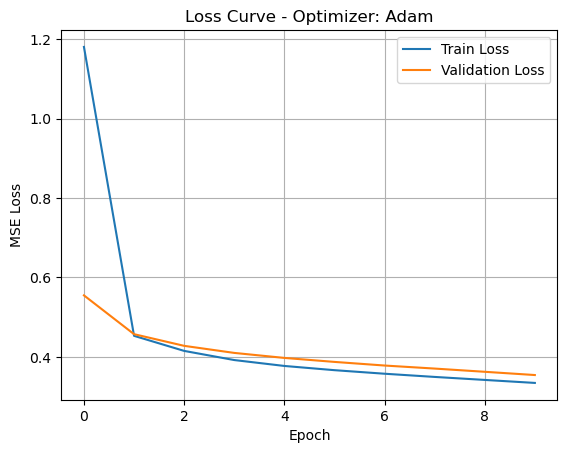
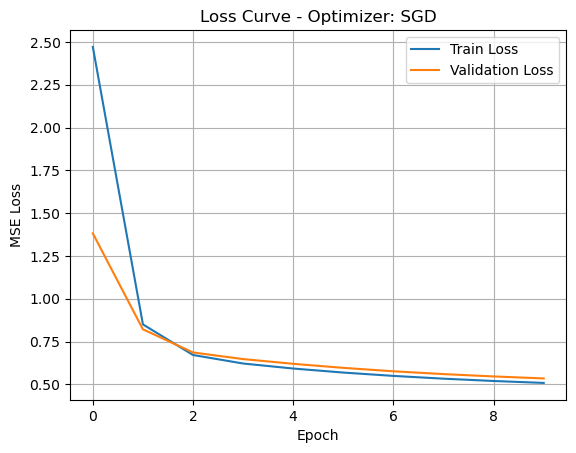
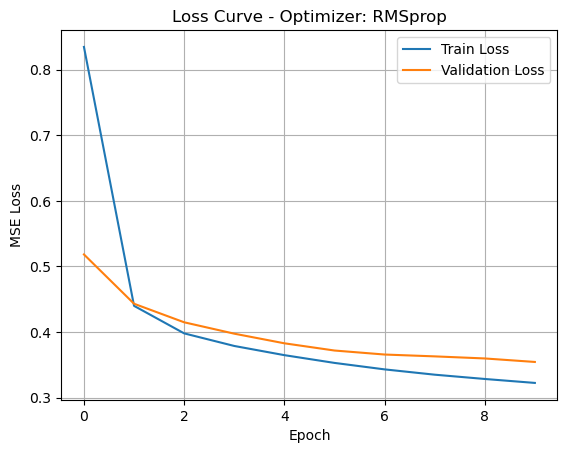
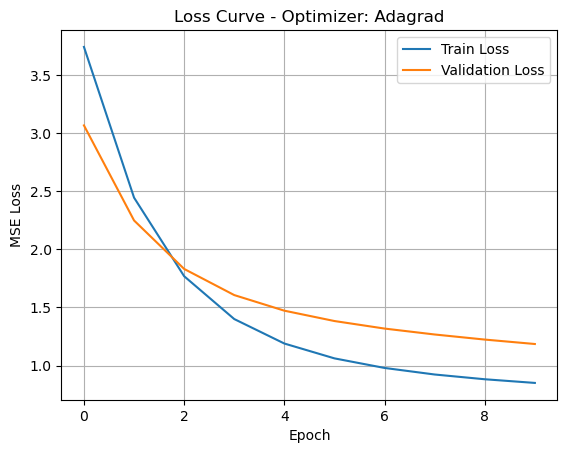
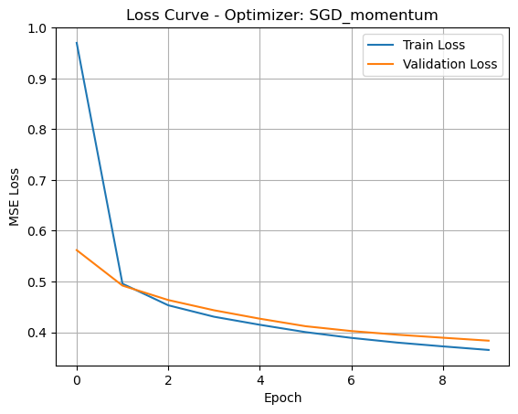
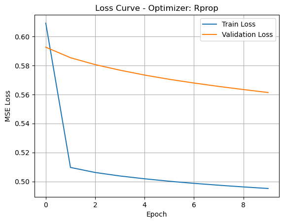
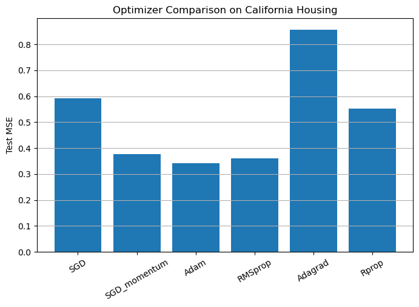

# Optimizer Regression: README Documentation

## 📌 Project Overview
This project demonstrates the effect of various **gradient descent (GD) optimization algorithms** on training a **Multilayer Perceptron (MLP)** model for a regression task using the **California Housing dataset**. The core objective is to analyze and compare optimizers such as Adam, SGD, RMSprop, Adagrad, Rprop, and SGD with momentum.

---

## 📂 Dataset: California Housing
- Source: `sklearn.datasets.fetch_california_housing()`
- Type: Tabular Regression
- Features: 8 continuous numerical features (e.g., average rooms, population)
- Target: Median house value for California districts
- Size: ~20,000 samples
- Preprocessing: Features are standardized using `StandardScaler`

---

## 🧠 Model Architecture: Multilayer Perceptron (MLP)
- Input Layer: 8 features
- Hidden Layers:
  - Dense(32) → ReLU
  - Dense(16) → ReLU
- Output Layer: 1 neuron (for regression)

This small MLP is effective for tabular data and allows visible differences in optimizer behavior.

---

## 📘 Introduction to Gradient Descent
**Gradient Descent (GD)** is an optimization algorithm used to minimize loss functions by updating model weights iteratively based on gradients.

### 🔄 Variants of GD and Optimizers Used:

| Optimizer       | Description |
|----------------|-------------|
| **SGD**        | Stochastic Gradient Descent – updates weights using single-batch gradients. Sensitive to learning rate.
| **SGD + Momentum** | Adds a velocity term to smooth updates and accelerate convergence.
| **Adam**       | Adaptive Moment Estimation – combines momentum and adaptive learning rates. Good default.
| **RMSprop**    | Maintains a moving average of squared gradients. Stabilizes learning rate per weight.
| **Adagrad**    | Adapts learning rate per parameter based on historical gradient accumulation. Can decay too quickly.
| **Rprop**      | Resilient backpropagation – uses only the sign of gradient, not its magnitude. Not ideal for minibatches.

For detailed theoretical information, please do read my related blog on Medium [Understanding Backpropagation and Its Variants](https://medium.com/@pranav10srinivas/understanding-backpropagation-and-its-variants-1b29ec180f59)

---

## ⚙️ Training Setup
- Loss Function: Mean Squared Error (MSE)
- Optimizers: Swappable using argument `optimizer_name`
- Epochs: 10–20
- Batch Size: 32 or 64
- Evaluation:
  - Train & Validation loss curves per optimizer
  - Final Test MSE comparison (bar chart)

---

## 📊 Insights

- **Adam** showed the fastest and most consistent performance.
- **SGD with momentum** provided stable results, close to Adam.
- **Adagrad** and **Rprop** underperformed in both convergence and generalization.

## Plots

1. Adam
Convergence Speed: Very fast – significant drop within the first 2 epochs.
Stability: Smooth and steadily declining.
Generalization: Excellent; training and validation curves are very close.


2. SGD
Convergence Speed: Slower than Adam; steeper learning curve for the first few epochs.
Stability: Acceptable but less smooth than Adam.
Generalization: Good, but not optimal.


3. RMSprop
Convergence Speed: Fairly fast and stable.
Stability: Smooth, but slightly higher gap between training and validation loss than Adam.
Generalization: Good; some mild overfitting signs.


4. Adagrad
Convergence Speed: Poor; very slow compared to others.
Stability: Smooth but not efficient.
Generalization: Poor – validation loss significantly above training loss.


5. SGD with Momentum
Convergence Speed: Good – slightly better than plain SGD.
Stability: High; smooth decline.
Generalization: Excellent – very small train-val loss gap.


6. Rprop
Convergence Speed: Slow.
Stability: Smooth but flat – training loss barely improves after epoch 1.
Generalization: Not great – persistent validation gap.

## Test MSE Comparison

---

## 🏁 How to Run
In a Jupyter Notebook:
```python
# Example
run_experiment(optimizer_name='Adam', epochs=10)
```

To run for all optimizers:
```python
for opt in ['SGD', 'SGD_momentum', 'Adam', 'RMSprop', 'Adagrad', 'Rprop']:
    run_experiment(optimizer_name=opt)
```

---

## 📦 Folder Structure
```
optimizer_regression/
├── train.py                  # Main training and plotting script
├── models/mlp.py            # MLP model definition
├── optim/get_optimizer.py   # Optimizer selector function
├── plots/                   # Loss curves for each optimizer
├── README.md                # Documentation (this file)
```

---


## ✍️ Author
This project was created as a comparative study of gradient descent optimizers using PyTorch.
Feel free to contribute improvements or extend it to classification or deeper architectures.
